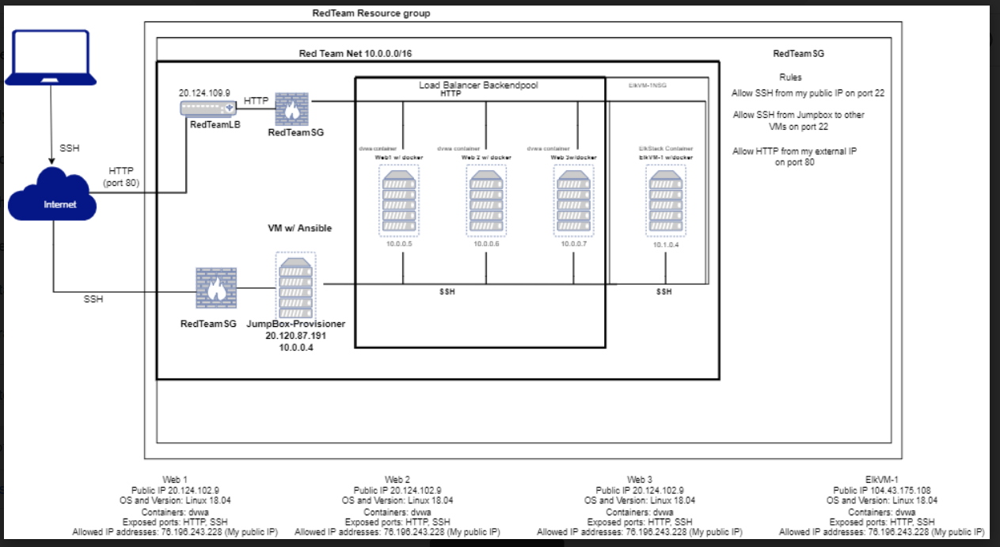
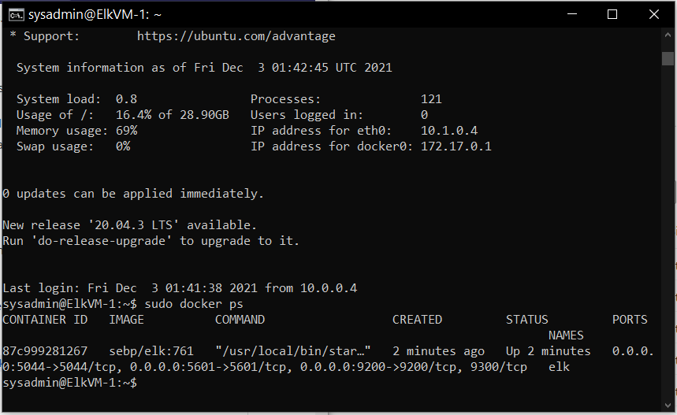

# Elk-stack-Project
Setting up Elk Stack VM, Ansible, Docker, and Kibana with Filebeat and Metricbeat.

## Automated ELK Stack Deployment

The files in this repository were used to configure the network depicted below.

  

These files have been tested and used to generate a live ELK deployment on Azure. They can be used to either recreate the entire deployment pictured above. Alternatively, select portions of the playbook file may be used to install only certain pieces of it, such as Filebeat.

- [install-elk.yml](Ansible/Elkstack-config/install-elk.yml)
- [filebeat-playbook.yml](Ansible/Filebeat/filebeat-playbook.yml)
- [metricbeat-playbook.yml](Ansible/Metricbeat/metricbeat-playbook.yml)

This document contains the following details:

- Description of the Topology
- Access Policies
- ELK Configuration
  - Beats in Use
  - Machines Being Monitored
- How to Use the Ansible Build

### Description of the Topology

The main purpose of this network is to expose a load-balanced and monitored instance of DVWA, the D*mn Vulnerable Web Application.

Load balancing ensures that the application will be highly available, in addition to restricting requests to the network.

- _TODO: What aspect of security do load balancers protect? What is the advantage of a jump box?_
  - Load balancers protect the availability of services. They make sure servers, applications, and networks will be accessible. They help protect against DDOS attacks.
  - The jump box is a resource used to configure the rest of the Virtual machines so that we do not have to configure each one individually.  It can have restricted access so that it will not be compromised as we are setting up the rest of the machines.

Integrating an ELK server allows users to easily monitor the vulnerable VMs for changes to the data and system logs.

- _TODO: What does Filebeat watch for?_
  - Filebeat watches for log files and log events that take place on the Web VMs. It helps us to organize and see specific data we are interested in.

- _TODO: What does Metricbeat record?_
  - Metricbeat collects metrics and statistics for machine services such as the uptime.

The configuration details of each machine may be found below.
_Note: Use the [Markdown Table Generator](http://www.tablesgenerator.com/markdown_tables) to add/remove values from the table_.

| Name     | Function | IP Address | Operating System |
| -------- | -------- | ---------- | ---------------- |
| Jump Box | Gateway  | 10.0.0.4   | Linux            |
| Web-1    | DVWA     | 10.0.0.5   | Linux            |
| Web-2    | DVWA     | 10.0.0.6   | Linux            |
| Web-3    | DVWA     | 10.0.0.7   | Linux            |
| ElkVM-1  | Kibana   | 10.1.0.4   | Linux            |

### Access Policies

The machines on the internal network are not exposed to the public Internet. 

Only the Jump Box machine can accept connections from the Internet. Access to this machine is only allowed from the following IP addresses:

- 76.196.243.228

Machines within the network can only be accessed by JumpBox-Provisioner.

- _TODO: Which machine did you allow to access your ELK VM? What was its IP address?_
  - We allowed our Jump box access to our Elk VM.
  - Jumpbox-Provisioner IP is 20.120.87.191

A summary of the access policies in place can be found in the table below.

| Name     | Publicly Accessible | Allowed IP Addresses |
| -------- | ------------------- | -------------------- |
| Jump Box | Yes                 | 76.196.243.228       |
| Web-1    | No                  | 10.0.0.4 (Jump Box)  |
| Web-2    | No                  | 10.0.0.4 (Jump Box)  |
| Web-3    | No                  | 10.0.0.4 (Jump Box)  |
| ElkVM    | No                  | 10.0.0.4 (Jump Box)  |

### Elk Configuration

Ansible was used to automate configuration of the ELK machine. No configuration was performed manually, which is advantageous because...

- _TODO: What is the main advantage of automating configuration with Ansible?
  - The man advantage of automating configuration is that if you had 10,000 VMs to configure you would not have to configure each one manually. You may make a mistake once but you would only have to correct it once, rather than go back and correct each one individually.

The playbook implements the following tasks:

- _TODO: In 3-5 bullets, explain the steps of the ELK installation play. E.g., install Docker; download image; etc._
- First it will install Docker.io, python3-pip, and Docker module
- Then it will increase the memory available to it and download/launch the elk container. This includes the ports Elk will run on.
- Then it will enable access to the docker container on boot.

The following screenshot displays the result of running `docker ps` after successfully configuring the ELK instance.

### Target Machines & Beats

This ELK server is configured to monitor the following machines:

- _TODO: List the IP addresses of the machines you are monitoring_
  - 10.0.0.5 (Web-1)
  - 10.0.0.6 (Web-2)
  - 10.0.0.7 (Web-3)

We have installed the following Beats on these machines:

- Filebeat and Metricbeat

These Beats allow us to collect the following information from each machine:

- When we run Filebeat it tracks specific log data on these Web VMs such as login attempts or added users. When we run metricbeat it allows us to collect statistics on the Web VMs such as uptime, CPU, or memory used by services.

### Using the Playbook

In order to use the playbook, you will need to have an Ansible control node already configured. Assuming you have such a control node provisioned: 

SSH into the control node and follow the steps below:

- Copy the yaml file to /etc/filebeat/.
- Update the hosts file to include the group and IP address of the new VM
- Run the playbook, and navigate to http://[your.ELK-VM.External.IP]:5601/app/kibana to check that the installation worked as expected.

_TODO: Answer the following questions to fill in the blanks:_

- _Which file is the playbook? Where do you copy it?_
  - filebeat-playbook.yml
  - /etc/filebeat/filebeat-playbook.yml

- _Which file do you update to make Ansible run the playbook on a specific machine? How do I specify which machine to install the ELK server on versus which to install Filebeat on?_
  - ansible hosts file
  - 

- _Which URL do you navigate to in order to check that the ELK server is running?
  - http://[your.ELK-VM.External.IP]:5601/app/kibana
